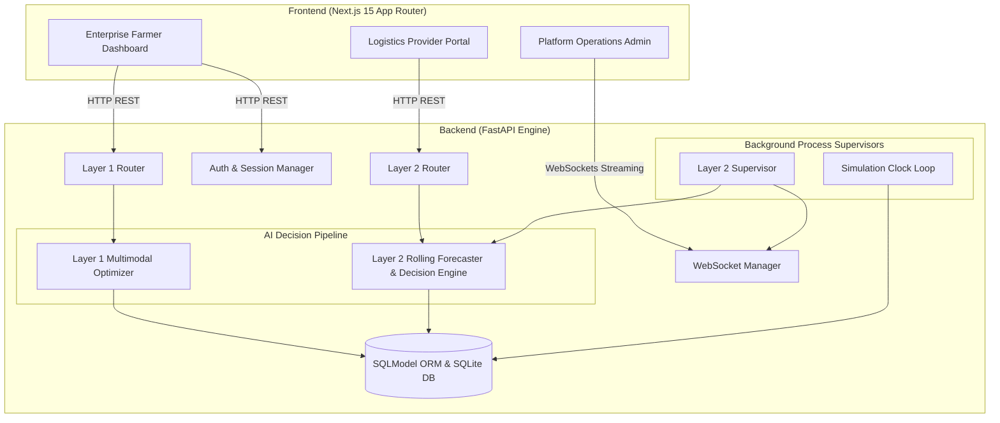
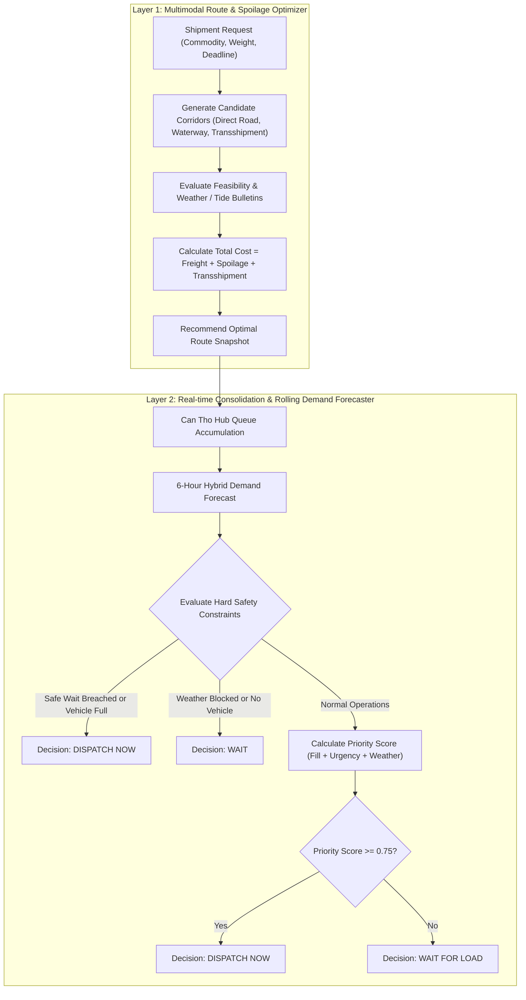
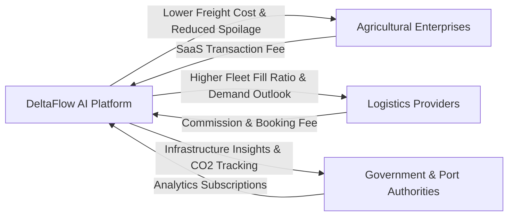
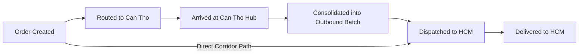

# DeltaFlow AI — Mekong Delta Multimodal Agri-Logistics Orchestrator

> **An AI-Native Multimodal Logistics Orchestration Platform optimizing agricultural perishability, shipping costs, and fleet utilization across the Mekong Delta region.**

---

## 1. System Overview & Problem Statement

Vietnam's Mekong Delta region (Đồng bằng Sông Cửu Long) produces **50% of the nation's rice, 70% of its fruits, and 65% of its seafood**. However, agricultural logistics in the region faces three structural bottlenecks:

1.  **Over-reliance on Road Transport**: Over **80% of freight** moves via trucks on congested expressways to Ho Chi Minh City, while inland waterways—the region's natural geography—remain underutilized.
2.  **High Post-Harvest Spoilage**: Perishable cargo (seafood and fresh fruits) degrades rapidly during transit delays, contributing to a 15–20% post-harvest loss rate.
3.  **High Logistics Costs**: Logistics accounts for **20–25% of Vietnam's agricultural GDP**, driven by empty return trips and fragmented cargo dispatching.

**DeltaFlow AI** addresses these challenges through a unified multimodal orchestration engine that combines inland waterway barging with road transport, automated by a **2-Layer AI Decision Engine**.

---

## 2. Technical Architecture & System Specifications

### 2.1 Technology Stack

The platform is engineered as an event-driven, full-stack application featuring real-time WebSocket push synchronization:

*   **Backend (FastAPI & Python 3.11)**:
    *   **FastAPI**: High-performance asynchronous framework serving REST APIs and streaming WebSockets.
    *   **SQLModel & SQLite**: Type-safe ORM combining SQLAlchemy and Pydantic for relational data persistence.
    *   **Uvicorn**: Asynchronous ASGI server executing background process loops and process-local supervisors.
*   **Frontend (Next.js 15 & TypeScript)**:
    *   **Next.js (App Router)**: Single Page Application (SPA) architecture with role-scoped layouts.
    *   **Leaflet & OpenStreetMap**: Interactive GIS engine rendering nodes, dynamic polylines, custom markers, and interpolated transit tracking.
    *   **Design System**: Lightweight CSS grid layout tokens (`.admin-two-column-layout`) inspired by modern portal aesthetics.
    *   **WebSockets**: Bi-directional streaming channel pushing system clock ticks, vehicle locations, and order status updates.

### 2.2 Component Architecture Diagram



### 2.3 Database Schema Specification

All transactional states are managed in SQLite via SQLModel definitions:

1.  **`User`**: Manages authentication sessions (`email`, `password_hash`, `role`: `"enterprise" | "logistics" | "admin"`).
2.  **`Order`**: Tracks individual agricultural shipments (`hub_id`, `loai_hang`, `khoi_luong_kg`, `state`, `assigned_vehicle_id`, `provider_assignment_status`, `route_options_json`, `predicted_full_load_time`, `priority_score_json`).
3.  **`DispatchOrder`**: Represents consolidated outbound journeys from Can Tho Hub to HCM (`proposal_id`, `vehicle_id`, `outbound_mode`, `shipment_ids_json`, `fill_ratio`, `status`, `dispatched_at`, `eta_hcm`).
4.  **`Vehicle`**: Represents transport fleet assets (`license_plate`, `provider_id`, `mode`, `capacity_kg`, `status`, `supports_refrigeration`, `current_lat`, `current_lng`).
5.  **`CargoInventory`**: Manages consolidated hub volume metrics per commodity category.
6.  **`SystemLog`**: Audit trail recording AI decision logs, weather overrides, and supervisor events.

### 2.4 Codebase Directory Map

```
VAIC/
├── backend/
│   ├── app/
│   │   ├── ai/
│   │   │   ├── forecast_dispatch/   # Layer 2 Consolidation & Forecasting Engine
│   │   │   └── route_optimizer/     # Layer 1 Path & Spoilage Optimizer
│   │   ├── routes/                  # REST & WebSocket API Controllers
│   │   ├── services/                # Business logic, simulation clock & supervisor
│   │   ├── config.py & database.py  # Configuration & DB bootstrapping
│   │   └── main.py                  # FastAPI initialization & lifespan tasks
│   └── data/                        # Historical CSV datasets (Weather, Legs, Pricing)
└── frontend/
    └── src/
        ├── app/                     # Next.js App Router (admin, enterprise, logistics)
        ├── components/              # Reusable UI components (VaicMap, DashboardShell)
        ├── context/                 # Auth & Multilingual Contexts
        └── styles/                  # Custom CSS design system (globals.css)
```

---

## 3. AI-Native 2-Layer Decision Pipeline

DeltaFlow AI employs a **2-Layer AI Architecture** balancing individual shipment cost optimization with regional hub consolidation.



### 3.1 Layer 1: Multimodal Route & Perishability Optimizer

When an enterprise submits a shipment, Layer 1 evaluates 5 candidate corridors between the origin hub and Ho Chi Minh City:
1. `A_DIRECT_ROAD`: Direct truck transport to HCMC.
2. `B_ROAD_VIA_CT`: Truck to Can Tho Hub $\rightarrow$ Truck to HCMC.
3. `C_WATER_ROAD_VIA_CT`: Barge to Can Tho Hub $\rightarrow$ Truck to HCMC.
4. `D_WATER_VIA_CT`: Barge to Can Tho Hub $\rightarrow$ Barge to HCMC.
5. `E_ROAD_WATER_VIA_CT`: Truck to Can Tho Hub $\rightarrow$ Barge to HCMC.

#### Mathematical Cost Formulation
The optimizer minimizes total economic cost:
$$\text{Total Cost} = \text{Cost}_{\text{freight}} + \text{Cost}_{\text{spoilage}} + \text{Fee}_{\text{transshipment}}$$

*   **Freight Cost ($\text{Cost}_{\text{freight}}$)**: Calculated using fixed pricing matrices by leg distance and vehicle type, with fallback to fuel prices (Diesel 0.05S / Marine Diesel) multiplied by consumption rates.
*   **Spoilage Cost ($\text{Cost}_{\text{spoilage}}$)**: Calculated based on commodity market value per kg ($V$), hourly decay rate ($\delta$), cargo weight ($W$), and total hours ($T$):
    $$\text{Cost}_{\text{spoilage}} = W \cdot V \cdot (1 - e^{-\delta \cdot T})$$
*   **Transshipment Fee ($\text{Fee}_{\text{transshipment}}$)**: Fixed handling fee of 150 VND/kg applied when transshipping at Can Tho Hub.

### 3.2 Layer 2: Real-time Consolidation & Demand Forecaster

Layer 2 monitors cargo accumulation at the Can Tho Hub and automates outbound dispatch decisions to maximize barge/truck fill ratios while honoring perishable safe-wait windows.

#### 6-Hour Hybrid Rolling Demand Forecast
To predict when a target vehicle will fill, Layer 2 projects cumulative cargo volume over a 6-hour horizon using 30-minute buckets:
$$L_{\text{cumulative}}(t) = L_{\text{arrived}} + \sum_{\text{inbound}} W_{\text{inbound}}(t) + \sum_{\text{buckets}} \text{RollingMean}_{\text{historical}}(t)$$

#### Priority Score Calculation & Decision Logic
If no hard constraints force an action, Layer 2 evaluates a weighted Priority Score ($S$):
$$S = \alpha \cdot \text{FillRatio} + \beta \cdot \text{UrgencyRatio} + \gamma \cdot \text{WeatherRisk}$$
*(Default weights: $\alpha = 0.55$, $\beta = 0.35$, $\gamma = 0.10$)*

*   If $S \ge 0.75 \implies \mathbf{DISPATCH\_NOW}$ (Create `DispatchOrder`, assign vehicle, deduct inventory).
*   If $S < 0.75 \implies \mathbf{WAIT\_FOR\_LOAD}$ (Wait for additional inbound cargo until `predicted_full_load_time`).

---

## 4. Business Value, Monetization & Regional Roadmap

### 4.1 Quantified Business Impact

| Metric | Baseline (Direct Road) | DeltaFlow AI Multimodal | Net Benefit |
| :--- | :--- | :--- | :--- |
| **Shipping Cost** | 1,200 – 1,500 VND/kg | 850 – 1,050 VND/kg | **15% – 28% Freight Savings** |
| **Post-Harvest Loss** | 15% – 20% spoilage | 8% – 10% spoilage | **35% Reduction in Spoilage** |
| **CO₂ Emissions** | 105 g CO₂/ton-km | 38 g CO₂/ton-km | **40% Carbon Footprint Reduction** |
| **Fleet Fill Ratio** | 55% average load | 88% average load | **+33% Vehicle Utilization** |

### 4.2 Multi-Stakeholder Ecosystem & Monetization Model



### 4.3 Order State Lifecycle



### 4.4 3-Phase Regional Pilot Roadmap

*   **Phase 1: Can Tho Hub Pilot (Months 1–3)**
    *   Focus on Hau Giang & Soc Trang agricultural corridors (Rice & Pangasius).
    *   Deploy Layer 1 & 2 optimization at Can Tho Hub with 5 participating logistics partners.
*   **Phase 2: Regional Hub Expansion (Months 4–8)**
    *   Extend network to Long Xuyen (An Giang) and Vinh Long transshipment hubs.
    *   Integrate real-time weather bulletin APIs and river tide gauge telemetry.
*   **Phase 3: Autonomous Fleet Orchestration (Months 9–12)**
    *   Scale to cover all 13 Mekong Delta provinces.
    *   API integration with national customs, port authority systems, and carbon credit registries.

---

## 5. Design System & User Experience (UX)

### 5.1 Persona-Centric Dashboard Workflows

The frontend implements 3 distinct role-tailored user interfaces using a unified VinUni-inspired design system:

1.  **Enterprise Farmer Portal (`/enterprise`)**:
    *   **3-Step Order Creation**: Simplified form capturing harvest time, weight, commodity type, and deadline.
    *   **Interactive AI Route Selection**: Visual comparison of candidate routes showing cost, time, and AI recommendations.
    *   **Clean Tracking Map**: Minimalist map displaying only active route paths with a simplified 2-color legend (Road vs Waterway).
2.  **Logistics Provider Portal (`/logistics`)**:
    *   **Order Acceptance & Booking**: View pending shipments at hubs and accept loads matching available fleet assets.
    *   **Capacity & Demand Forecasting**: 6-hour demand outlook to assist fleet dispatchers.
3.  **Platform Operations Admin (`/admin`)**:
    *   **2-Column Split Layout**: Left main panel (forecasts, Mekong Delta map, action center, activity logs) + Right stats column (KPI cards stacked vertically).
    *   **Simulation Control Header**: Real-time simulation clock controls allowing speed adjustments (1x to 5x pacing) for demonstration.

### 5.2 Mathematical Progress Interpolation (Hardware-Free Tracking)

DeltaFlow AI provides real-time map tracking without requiring physical GPS hardware on every vehicle.

#### Position Interpolation Equation
Given an order's departure time ($T_{\text{start}}$) and estimated arrival time ($T_{\text{ETA}}$), position progress ratio $p(t)$ at simulation time $t$ is:
$$p(t) = \min\left(1.0, \max\left(0.0, \frac{t - T_{\text{start}}}{T_{\text{ETA}} - T_{\text{start}}}\right)\right)$$

The function `_point_along_segments` interpolates $p(t)$ across polyline geocoordinates, broadcasting real-time lat/lon coordinates over WebSockets to animate Leaflet map markers smoothly.

---

## 6. AI Safety, Grounding & Reliability Guardrails

### 6.1 Hard Constraint Safety Overrides
AI recommendation scores are strictly bounded by deterministic safety checks that unconditionally override probability metrics:

> [!IMPORTANT]
> **Safety Rule 1: Perishability Limit (Safe Wait Window)**
> If an order's waiting time exceeds its commodity's `max_safe_wait_hours` (e.g. 6 hours for seafood vs 48 hours for rice), Layer 2 immediately triggers `DISPATCH_NOW` with reason code `SAFE_WAIT_LIMIT_REACHED`, regardless of vehicle fill ratio.

> [!WARNING]
> **Safety Rule 2: Weather & Flood Blockages**
> If meteorological bulletins report highway flooding or river closures, affected route segments are flagged `unavailable`. Layer 2 overrides dispatch with `WAIT_FOR_LOAD` and code `WEATHER_BLOCKED`.

### 6.2 Zero Hallucination Design
*   **Database Grounding**: All candidate routes, pricing rules, fuel rates, and leg distances are strictly derived from validated database tables and historical CSV records.
*   **Structured Output**: All AI decisions return strongly typed Pydantic models with explicit reason codes (`reason_codes_json`) and priority breakdowns.

### 6.3 System Resilience
*   **REST Autorouting Fallback**: If WebSockets disconnect, the frontend seamlessly falls back to polling REST endpoints (`/api/v1/dashboard`).
*   **Fixed Layout Anchoring**: Sidebar elements use `position: sticky` with `align-self: start` to guarantee zero layout shifts across dynamic state renders.

---

## 7. Local Installation & Quick Start

### 7.1 Prerequisites
*   **Python**: 3.10 or higher
*   **Node.js**: 18.0 or higher
*   **npm**: 9.0 or higher

### 7.2 Backend Setup (FastAPI)

1.  Navigate to the backend directory:
    ```bash
    cd backend
    ```
2.  Create and activate a virtual environment:
    ```bash
    python -m venv venv
    source venv/bin/activate  # On Windows: venv\Scripts\activate
    ```
3.  Install Python dependencies:
    ```bash
    pip install -r requirements.txt
    ```
4.  Launch the FastAPI server:
    ```bash
    uvicorn app.main:app --reload --host 127.0.0.1 --port 8000
    ```
    *API documentation available at `http://127.0.0.1:8000/docs`*

### 7.3 Frontend Setup (Next.js)

1.  Navigate to the frontend directory:
    ```bash
    cd frontend
    ```
2.  Install Node dependencies:
    ```bash
    npm install
    ```
3.  Set up environment configuration:
    ```bash
    cp .env.example .env
    ```
4.  Run the Next.js development server:
    ```bash
    npm run dev
    ```
    *Access the web app at `http://localhost:3000`*

### 7.4 Production Build Verification
To run a full production build check:
```bash
cd frontend && npm run build
```

---

## License & Acknowledgments

Developed for the **Vietnam AI Innovation Challenge (VAIC)**. Built with FastAPI, Next.js, Leaflet, SQLModel, and OpenStreetMap data.
