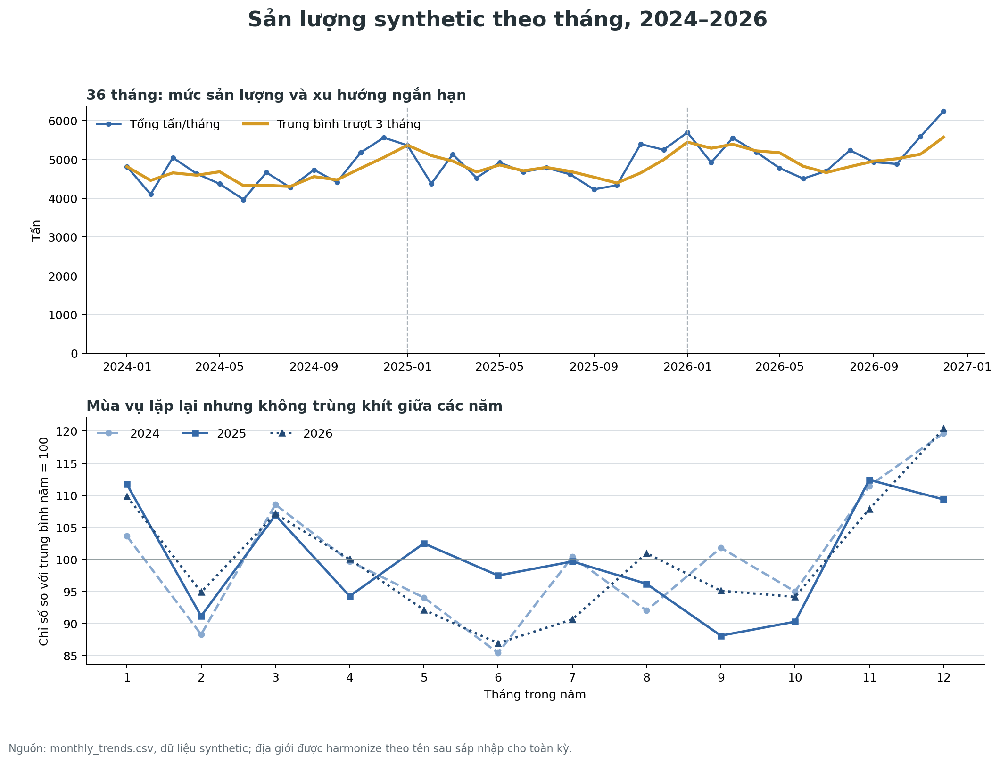

# Báo cáo kỹ thuật synthetic data VAIC — 2024-2026

**Dataset version:** 4.0  
**Seed chuẩn:** 20260717  
**Thời gian:** 2024-01-01 00:00 đến 2026-12-31 23:00, `Asia/Bangkok`  
**Ngày lập báo cáo:** 2026-07-18

## Tóm tắt kỹ thuật

Pack `three_year` đã được triển khai thành công cho đủ 36 tháng, giữ nguyên 11 bảng canonical của contract v3 và bổ sung partition theo năm, bảng analytics, temporal holdout forecast cùng các lớp kiểm tra chống overfitting/underfitting. Seed chuẩn tạo 25,771 đơn hàng, 157,824 bản ghi thời tiết và 368,256 bản ghi giá cước.

Tất cả bản ghi 2024-2026 dùng **tên tỉnh/thành sau sáp nhập** để khóa join địa lý nhất quán. Đây là analytical harmonization theo yêu cầu dự án, không phải lịch sử tên pháp lý tại thời điểm phát sinh dữ liệu. Dataset không tạo bước nhảy nhu cầu giả tại tháng 7/2025 do đổi địa giới.

Quality audit đạt **15/15**, multi-seed guardrail đạt **4/4**, full reproducibility validator đạt **78/78**, legacy validator đạt **534/534** và test suite đạt **16/16**. Dữ liệu có seasonal signal rõ nhưng không lặp cứng: lag-12 autocorrelation là `0.671473`, peak/trough tháng là `1.572892x`, còn tương quan weather-order bất lợi chỉ ở mức `-0.131212`.

Forecast holdout cho thấy daily grain vẫn khó: calendar-trend ridge đạt WAPE `0.328459`, R² `0.070885`. Ở monthly grain, rolling-28d tốt nhất với WAPE `0.053960`, R² `0.669019`. Kết quả này ủng hộ việc dùng pack cho demo trend/consolidation, nhưng chưa đủ để tuyên bố một model dự báo ngày đã sẵn sàng vận hành.

## Kết quả chính

Biểu đồ trên cho thấy ba đặc điểm mong muốn cùng tồn tại:

1. Tải theo tháng có chu kỳ lặp lại đủ để model học được.
2. Các năm không trùng khít vì có annual trend, year noise, weather anomaly và event riêng.
3. Không xuất hiện discontinuity nhân tạo tại mốc sáp nhập hành chính năm 2025.

Các chỉ số tổng hợp của seed chuẩn:

| Chỉ số | Giá trị | Diễn giải |
|---|---:|---|
| Số tháng orders/weather | 36 / 36 | Phủ đủ 2024-2026 |
| Tonnage 2024 | 55,801.136 tấn | Năm gốc |
| Tonnage 2025 | 57,638.628 tấn | Actual index 1.032929 |
| Tonnage 2026 | 62,270.266 tấn | Actual index 1.115932 |
| Peak/trough tháng | 1.572892x | Nằm trong guardrail mùa vụ |
| Lag-12 autocorrelation | 0.671473 | Chu kỳ năm có thể học |
| Tương quan cùng tháng giữa các năm | 0.657698 / 0.846726 / 0.688620 | Lặp pattern nhưng không copy |
| July-2025 comparable ratio | 1.020302 | Không có merger jump giả |
| Weather-order adverse correlation | -0.131212 | Quan hệ có hướng nhưng không hoàn hảo |

## Phạm vi và kích thước dữ liệu

### 11 bảng canonical

| Bảng | Rows | Columns | Kích thước CSV |
|---|---:|---:|---:|
| `nodes` | 6 | 9 | 0.001 MiB |
| `legs` | 14 | 11 | 0.002 MiB |
| `commodities` | 10 | 11 | 0.001 MiB |
| `orders` | 25,771 | 10 | 3.693 MiB |
| `weather` | 157,824 | 8 | 13.009 MiB |
| `fleet` | 77 | 12 | 0.010 MiB |
| `fuel_prices` | 237 | 5 | 0.016 MiB |
| `freight_rates` | 368,256 | 11 | 46.902 MiB |
| `weather_bulletins` | 6,576 | 14 | 3.908 MiB |
| `ops_notes` | 4,461 | 11 | 1.629 MiB |
| `policy_docs` | 10 | 7 | 0.003 MiB |
| **Tổng canonical CSV** | **563,252** |  | **69.173 MiB** |

Toàn bộ `three_year` pack, gồm canonical CSV, annual partitions, compatibility JSON, analytics và metadata, chiếm khoảng **160.503 MiB**.

### Một số dòng dữ liệu analytics

Trích từ `analytics/monthly_trends.csv`:

| month | hub_id | commodity_id | admin_name | order_count | total_weight_tons | avg_rainfall_mm | annual_index | seasonal_index |
|---|---|---|---|---:|---:|---:|---:|---:|
| 2024-01 | HUB_LONGXUYEN | COM_PANGASIUS | An Giang | 38 | 172.829 | 0.330 | 1.00 | 0.911 |
| 2024-01 | HUB_LONGXUYEN | COM_RICE | An Giang | 73 | 672.067 | 0.330 | 1.00 | 0.831 |
| 2024-01 | HUB_SOCTRANG | COM_PURPLE_ONION | Cần Thơ | 58 | 257.753 | 0.346 | 1.00 | 1.173 |
| 2024-01 | HUB_SOCTRANG | COM_SHRIMP | Cần Thơ | 48 | 158.176 | 0.346 | 1.00 | 0.732 |

Trích từ `analytics/weather_logistics_impacts.csv`:

| date | hub_id | rainfall_3d_mm | salinity_risk_14d | supply_factor | delay_factor | road_capacity_factor | freight_weather_factor |
|---|---|---:|---:|---:|---:|---:|---:|
| 2024-01-01 | HUB_LONGXUYEN | 0.000 | 0.0990 | 0.9911 | 1.0143 | 0.9875 | 1.0107 |
| 2024-01-01 | HUB_SOCTRANG | 0.000 | 0.5500 | 0.9505 | 1.0792 | 0.9307 | 1.0594 |
| 2024-01-01 | HUB_VINHLONG | 0.000 | 0.2475 | 0.9777 | 1.0356 | 0.9688 | 1.0267 |
| 2024-01-01 | HUB_VITHANH | 0.000 | 0.3025 | 0.9728 | 1.0436 | 0.9619 | 1.0327 |

## Địa lý nhất quán sau sáp nhập

`data/reference/node_admin_history.csv` chỉ có một mapping cho mỗi node. Ví dụ:

| Node | `admin_id` dùng cho 2024-2026 | `admin_name` |
|---|---|---|
| HUB_VITHANH | CANTHO_POST2025 | Cần Thơ |
| HUB_SOCTRANG | CANTHO_POST2025 | Cần Thơ |
| CT_HUB | CANTHO_POST2025 | Cần Thơ |
| HUB_LONGXUYEN | ANGIANG_POST2025 | An Giang |
| HUB_VINHLONG | VINHLONG_POST2025 | Vĩnh Long |
| HCM_MARKET | HCM_POST2025 | Thành phố Hồ Chí Minh |

Tên file `node_admin_history.csv` được giữ để tương thích planning ban đầu, nhưng nội dung v4 không còn history cutover. `valid_from=2024-01-01` chỉ biểu diễn phạm vi analytical view của dataset.

Field `region` trong compatibility `dataset_weather.json` cũng đã được chuẩn hóa. Toàn bộ ba năm chỉ có `can_tho`, `an_giang`, `vinh_long`, `thanh_pho_ho_chi_minh`; các mã cũ như `vi_thanh`, `soc_trang`, `long_xuyen` không còn được dùng làm khóa tỉnh/thành. Tên Vị Thanh/Sóc Trăng/Long Xuyên vẫn có thể xuất hiện ở `hub_name` hoặc `location_label` vì đó là tên điểm vận hành, không phải tên tỉnh của record.

## Phương pháp sinh dữ liệu

### Orders và seasonality

Annual demand index mục tiêu là `1.00`, `1.04`, `1.08`. Generator thêm hub/commodity growth adjustment và year noise có seed, được clip để tránh một seed bất thường phá vỡ xu hướng. Seasonal index kết hợp ba tầng:

- shared/market pattern: `0.35`;
- commodity production pattern: `0.50`;
- hub-specific pattern: `0.15`.

Year noise đã resolve của seed chuẩn là `0.995519`, `0.987994`, `1.009154`. Giá trị được ghi vào metadata thay vì ẩn trong code. Order ID chứa năm và sequence khởi động lại theo năm, giúp audit partition và timestamp.

### Weather và causal lag

Weather dùng xác suất mưa, gamma scale và river baseline theo tháng; mỗi năm có seeded anomaly riêng. Seed chuẩn resolve anomaly `0.976302`, `0.947771`, `0.995744`.

Tín hiệu weather không tác động tức thời hoàn toàn vào order. Generator dùng rainfall/flood lag 3 ngày và salinity lag 14 ngày để tạo `supply_factor`, `delay_factor`, priority adjustment, road capacity và freight factor. Đây là causal simulation assumption, không phải hệ số đã ước lượng từ dữ liệu thực.

### Tái lập và partition

Cùng code, resolved config và seed phải cho cùng primary key, row count và checksum. Mỗi bảng canonical có file nguyên khối và các partition `year=2024`, `year=2025`, `year=2026`; validator kiểm tra ghép partition và tái sinh toàn bộ pack.

## Đánh giá forecast temporal holdout

Thiết kế đánh giá khóa theo thời gian:

- train: 2024-01-01 đến 2025-12-31;
- test: 2026-01-01 đến 2026-12-31;
- không random split;
- không tune model trên test 2026;
- báo riêng daily-hub và monthly-hub.

| Model | Grain | WAPE | R² | Nhận xét |
|---|---|---:|---:|---|
| seasonal_naive | daily_hub | 0.464112 | -0.875145 | Yếu, cùng ngày năm trước không đủ |
| rolling_28d | daily_hub | 0.342883 | 0.003592 | Gần mean baseline |
| monthly_seasonal | daily_hub | 0.344134 | -0.029072 | Không cải thiện ở grain ngày |
| calendar_trend_ridge | daily_hub | **0.328459** | **0.070885** | Tốt nhất daily nhưng signal còn yếu |
| seasonal_naive | monthly_hub | 0.114431 | -0.370087 | Baseline yếu |
| rolling_28d | monthly_hub | **0.053960** | **0.669019** | Tốt nhất monthly |
| monthly_seasonal | monthly_hub | 0.118045 | -0.341945 | Không thắng naive |
| calendar_trend_ridge | monthly_hub | 0.086738 | 0.153175 | Có trend nhưng thua rolling baseline |

Không nên chọn calendar ridge làm “winner” chung chỉ vì thắng daily WAPE. Ở monthly grain, một rolling baseline đơn giản tốt hơn rõ rệt. Đây là evidence chống overfitting vào narrative hoặc một metric thuận lợi.

## Validation và độ bền qua seed

### Seed chuẩn

- Quality audit: **PASS 15/15**.
- Three-year full validator: **PASS 78/78**, gồm reproducibility đầy đủ.
- Legacy annual/scenario validator: **PASS 534/534**.
- Pytest: **PASS 16/16**.

### Multi-seed guardrail

| Seed | Orders | Peak/trough | Lag-12 autocorr | Max annual-index relative error |
|---:|---:|---:|---:|---:|
| 20260717 | 25,771 | 1.5729 | 0.6715 | 3.3270% |
| 20261714 | 26,135 | 1.6438 | 0.8538 | 4.6024% |
| 20262711 | 25,642 | 1.4783 | 0.6290 | 0.7516% |

Cả ba seed đạt guardrail annual trend, seasonality range và lag-12 dương; đồng thời row count/output thay đổi giữa seed. Điều này giảm rủi ro dataset chỉ “đẹp” ở một seed duy nhất hoặc lặp pattern quá cứng.

### Kiểm tra tích hợp route optimizer

Optimizer hiện khớp **47/50 (94%)** golden reference cases. Ba serious direction mismatch còn lại là `EVAL_ROUTE_001`, `EVAL_ROUTE_019`, `EVAL_ROUTE_024`. Các case này được giữ nguyên để team optimizer xử lý; generator không sửa label, rate hay route preference nhằm ép model khớp reference. Chi tiết nằm ở `../../reference_mismatch_classification.json` tại root của repository.

## Giới hạn và rủi ro sử dụng

1. Đây là semi-synthetic dataset; không dùng làm giá thị trường, SLA, cảnh báo lũ hay quyết định điều độ thực tế.
2. Growth, mùa vụ, weather lag, river threshold, rate multiplier và merger harmonization là assumption. Chúng cần calibrate bằng dữ liệu pilot.
3. Việc gán tên sau sáp nhập cho cả 2024 làm join đơn giản hơn nhưng không phù hợp cho phân tích lịch sử pháp lý/địa giới.
4. Forecast daily R² thấp cho thấy signal ngày chưa đủ mạnh để benchmark model phức tạp; không nên tăng signal chỉ để làm metric đẹp nếu chưa có use case rõ.
5. 2026 là duy nhất một holdout year. Khi có dữ liệu thật, cần rolling-origin validation trên nhiều cửa sổ thời gian.
6. Canonical pack lớn nhất ở `freight_rates`; consumer nên dùng annual partitions và chọn cột cần thiết thay vì luôn tải toàn bộ.

## Khuyến nghị sử dụng

- Dùng `monthly_trends.csv` cho dashboard, EDA, seasonality và demand planning demo.
- Dùng canonical `orders`, `weather`, `fleet`, `fuel_prices`, `freight_rates` cho optimizer/dispatch có constraint.
- Dùng compatibility JSON cho frontend prototype, không dùng làm nguồn duy nhất cho optimizer.
- Dùng `weather_logistics_impacts.csv` để giải thích causal path, nhưng join về canonical tables nếu cần audit chi tiết.
- Khi benchmark forecast, luôn giữ 2026 làm test cho vòng hiện tại và báo baseline cùng model.

## Câu hỏi cần dữ liệu thực tiếp theo

1. Sản lượng và số chuyến theo hub/commodity/tháng thực tế nằm trong dải nào?
2. Mưa, lũ và xâm nhập mặn ảnh hưởng volume, delay và vehicle availability với độ trễ bao nhiêu?
3. Giá cước theo mode/leg có pass-through nhiên liệu thế nào và sau bao lâu?
4. Grain quyết định chính là ngày, tuần hay tháng? Câu trả lời này quyết định mức signal cần calibrate.
5. Mapping tỉnh/thành sau sáp nhập có cần thêm code hành chính chính thức cho downstream BI không?

## Tài liệu và artefact liên quan

- [README](../README.md)
- [Data contract](../SCHEMA.md)
- [Anchors và provenance](../ANCHORS.md)
- [Temporal config](../config/base_3y.yaml)
- [Quality audit seed chuẩn](quality_three_year_v4.json)
- [Multi-seed audit](quality_three_year_multiseed_v4.json)
- [Three-year validation](validation_three_year_v4.json)
- [Chart map](chart_map_three_year_v4.md)
